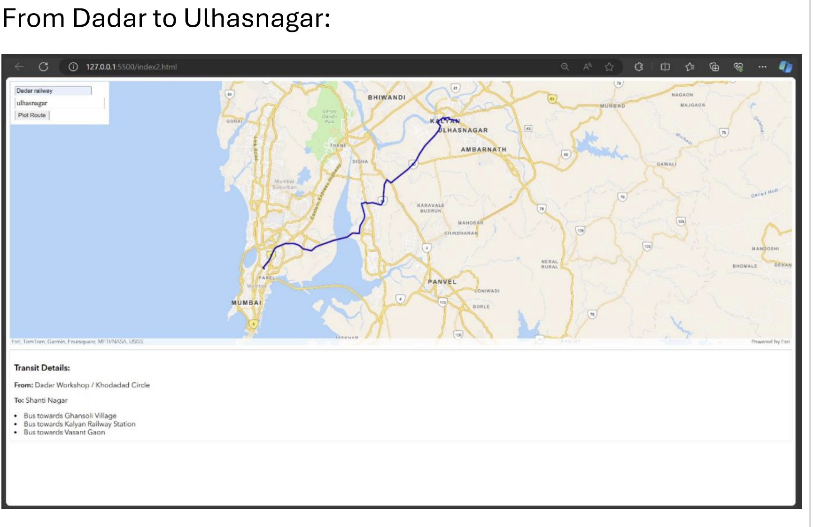

## Real-Time Transit Transportation System

IGT is an innovative real-time transit transportation system designed to enhance urban mobility, reduce traffic congestion, and promote sustainable transportation options.

## Results:

## Table of Contents
1. [Project Overview](#project-overview)
2. [Features](#features)
3. [Technology Stack](#technology-stack)
4. [Installation](#installation)
5. [Usage](#usage)
6. [Contributing](#contributing)
7. [License](#license)
8. [Contact](#contact)

## Project Overview

IGT leverages web technologies and mapping services to provide real-time transit information, intelligent routing, and green transportation options to city residents and visitors. Our system integrates data from various transportation modes, including buses and trains

## Features

- Real-time transit vehicle tracking
- Multimodal trip planning using Google Maps API
- Predictive arrival times
- Interactive maps powered by QGIS
- User-friendly web interface
- Responsive design for mobile and desktop use

## Technology Stack

- Frontend: HTML
- Mapping and Routing: Google Maps API
- Map Display: QGIS-generated maps

## Installation

1. Clone the repository:
git clone https://github.com/MehtaAbhii/IGT_Project-Real-Time-Transportation-.git
cd igt-project
2. Open `index.html` in your web browser to view the project locally.

## Usage

1. Open the IGT web application in your browser.
2. Allow location permissions for the best experience.
3. Use the interface to:
- View real-time transit information on the QGIS-generated maps
- Plan trips using the Google Maps API integration
- Locate nearby transit options, bike-sharing stations, and EV charging points

## License

This project is licensed under the MIT License - see the [LICENSE.md](LICENSE.md) file for details.
